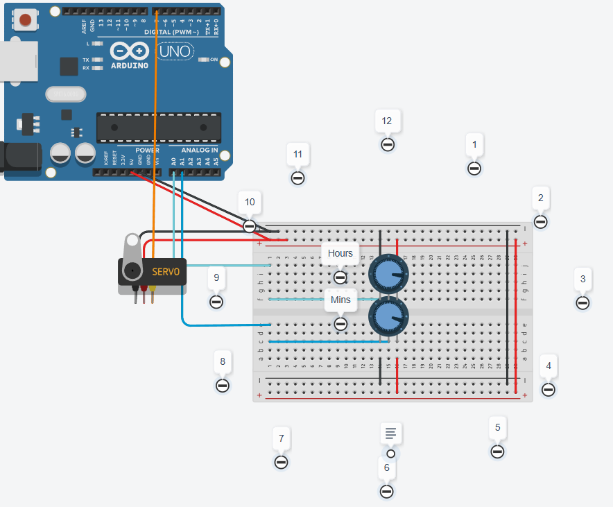
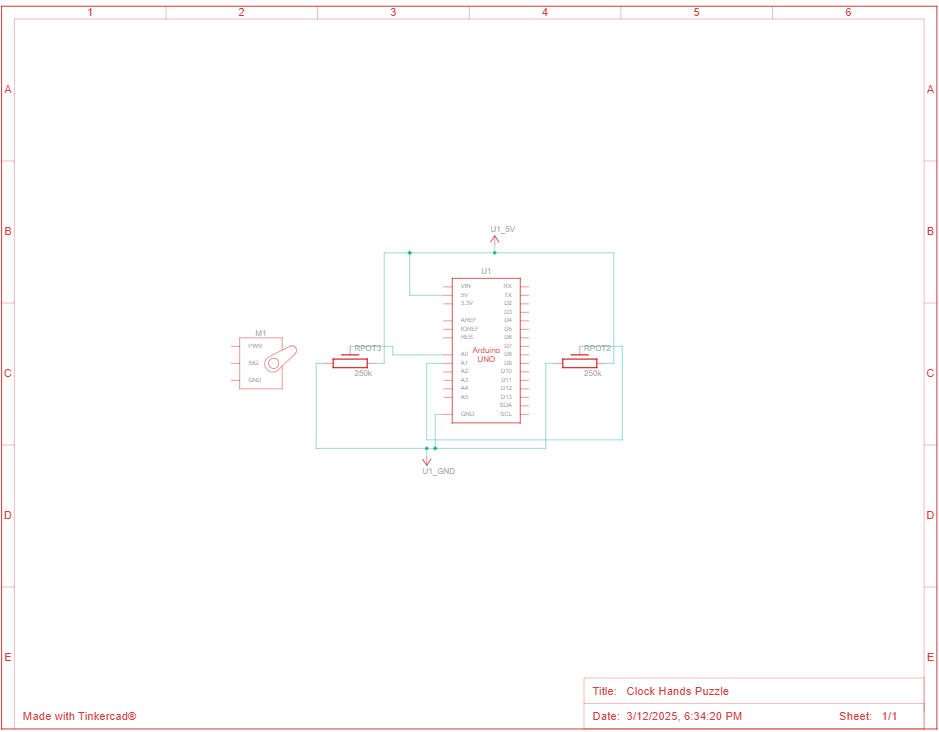

# Clock Hands Puzzle

## Description

The Clock Hands Puzzle simulates a clock with two potentiometers representing the hour and minute hands. The goal is to set the clock to a specific time (3:20) to trigger a mechanism, such as a servo. This puzzle is designed for an escape room or interactive project, where the user needs to adjust the clock to the correct time to proceed.

The project is implemented using Arduino and a servo mechanism. The potentiometers have a limited range (270°) and map to a clock where the hour range is from 8:00 PM to 5:00 PM, and the minute range is from 40 to 25 minutes past the hour. When the correct time is set (3:20), the mechanism is activated.

## Installation

To use this project, you'll need the following Arduino libraries:

* Servo.h

Simply install these libraries in your Arduino IDE, copy the provided code, and upload it to your Arduino board.

## Usage

1. Set the Hour: Rotate the upper potentiometer to adjust the hour hand. The available hours range from 8:00 PM to 5:00 PM.
2. Set the Minutes: Rotate the lower potentiometer to adjust the minute hand. The available minutes range from 40 to 25 minutes.
3. Trigger the Mechanism: Adjust the clock hands (hours and minutes) to 3:20. When this time is reached (with a 5 minute margin for the minutes), the mechanism (a servo) will activate, simulating the success of the puzzle.

## Notes

* The potentiometer's limited range means it won't get a full 360° rotation, but the mapping is designed to work within the constraints of the hardware.

* The system allows a small margin of error for the minutes (5 minutes).

## Screenshots 

### Tinkercad Simulation

### Circuit Schematic

## Live Simulation

You can test this circuit on Tinkercad:
[View tinkercad simulation](https://www.tinkercad.com/things/aI7hF7A8VmZ-clock-hands-puzzle)

## Questions

If you have any questions feel free to reach out:

* GitHub: https://github.com/fabricioGuac

* Email: guacutofabricio@gmail.com