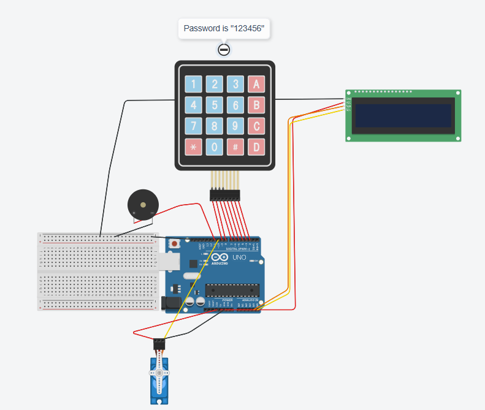
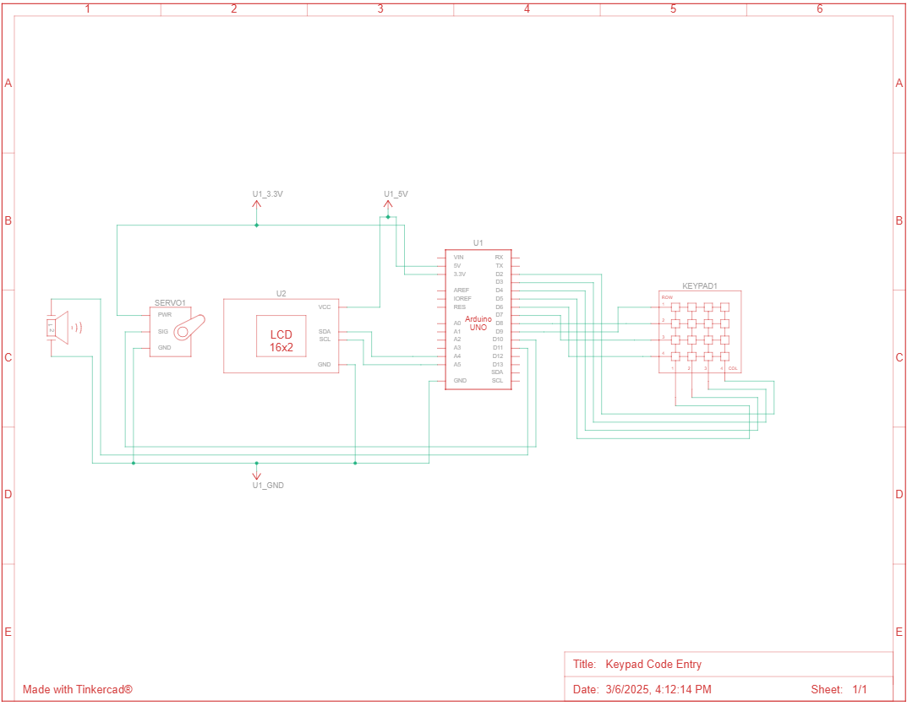

# Keypad Code Entry 

## Description

This project features a 4x4 keypad that requires a 6-character code to trigger an action. If the correct code ("123456") is entered, a mini servo motor moves, and a success tune plays. If the code is incorrect, a failure tune plays. In both cases, the system resets.

## Installation

To use this project, you'll need the following Arduino libraries:

* Servo.h
* Wire.h
* Keypad.h
* LiquidCrystal_I2C.h

Simply install these libraries in your Arduino IDE, copy the provided code, and upload it to your Arduino board.

## Usage

1. Enter the code using the 4x4 keypad.
2. If correct: The servo moves and a success sound plays.
3. If incorrect: A failure sound plays.

## Screenshots 

### Tinkercad Simulation

### Circuit Schematic

## Live Simulation

You can test this circuit on Tinkercad:
[View tinkercad simulation](https://www.tinkercad.com/things/1xDoP8IsCVB-keypad-code-entry-)

## Credits

This project was heavily inspired by the tutorial *"Using Keypads with Arduino"* by [DroneBot Workshop](https://www.youtube.com/@Dronebotworkshop). I highly recommend checking out their channel for more detailed Arduino tutorials and project ideas.

## Questions

If you have any questions feel free to reach out:

* GitHub: https://github.com/fabricioGuac

* Email: guacutofabricio@gmail.com