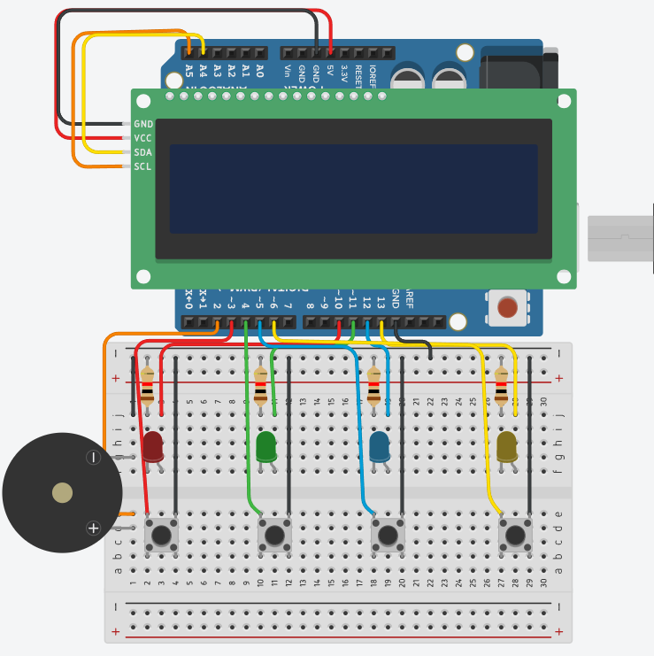
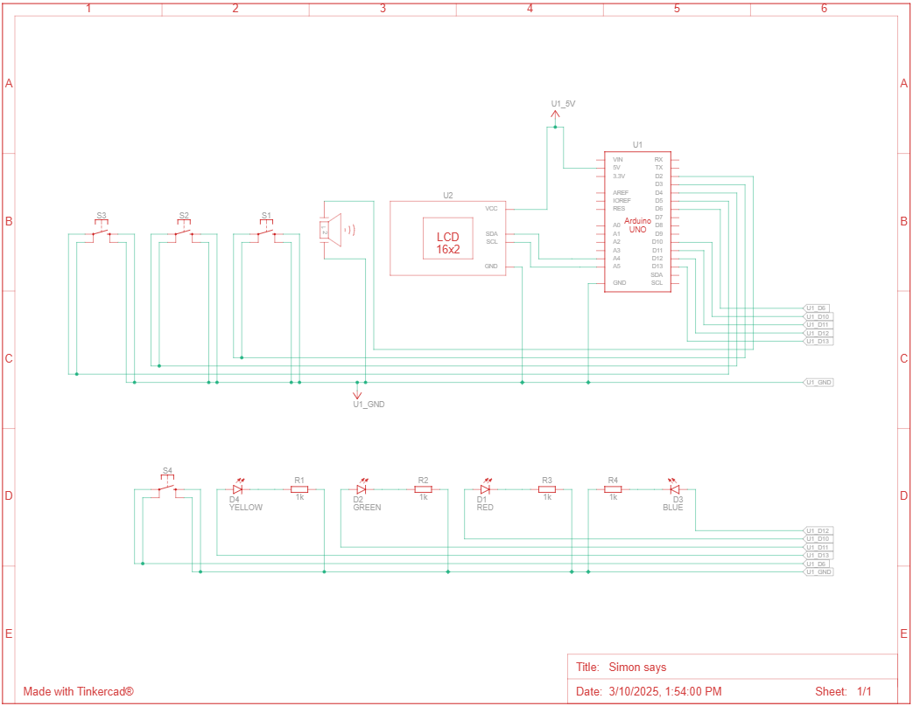

# Simon Says

## Description

This project is a Simon Says game implemented on an Arduino Uno with an LCD screen. The game starts with a "Starting game" message, then moves on to the levels, where the system shows a sequence of LED blinks and sounds. The player must repeat the sequence by pressing the buttons. If the player gets the sequence right, the game progresses to the next level. If all levels are cleared the message "Congratulations! You won" will be displayed in the LCD. If the player makes a mistaje, a "You lost" mesage will be displayed. After a win or loss, the game will automatically restart after a short delay. 

## Installation

To use this project, you'll need the following Arduino libraries:

* Wire.h
* LiquidCrystal_I2C.h

Simply install these libraries in your Arduino IDE, copy the provided code, and upload it to your Arduino board.

## Usage

1. The game starts with "Starting game" displayed on the LCD.
2. A sequence of LEDs is will light up, accompanied by sounds.
3. Repeat the sequence by pressing the corresponding buttons in the correct order.
4. If you succeed, a new step is added to the sequence, and the game continues.
5. If you complete all levels correctly, the LCD displays the winning message, and the game restarts.
6. If you make a mistake, the LCD displays a loosing message, and the game restarts.

## Screenshots 

### Tinkercad Simulation

### Circuit Schematic

## Live Simulation

You can test this circuit on Tinkercad:
[View tinkercad simulation](https://www.tinkercad.com/things/hEF7rY0w4B5-simon-says)

## Credits

This project was inspired by the following resources:

- **Arduino Sketches 5: Simon Game** by Mark Lawry [YouTube Channel](https://www.youtube.com/@MarkLawry)
- **Juego Simon Dice con Arduino - Simon Say** [YouTube Channel](https://www.youtube.com/@electgpl)

While I made many changes and improvements to the original concept, I relied on these tutorials for inspiration.

## Questions

If you have any questions feel free to reach out:

* GitHub: https://github.com/fabricioGuac

* Email: guacutofabricio@gmail.com